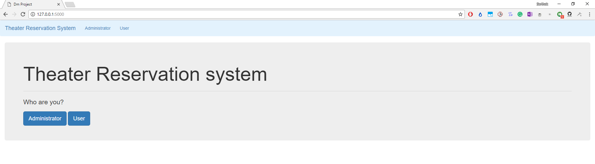
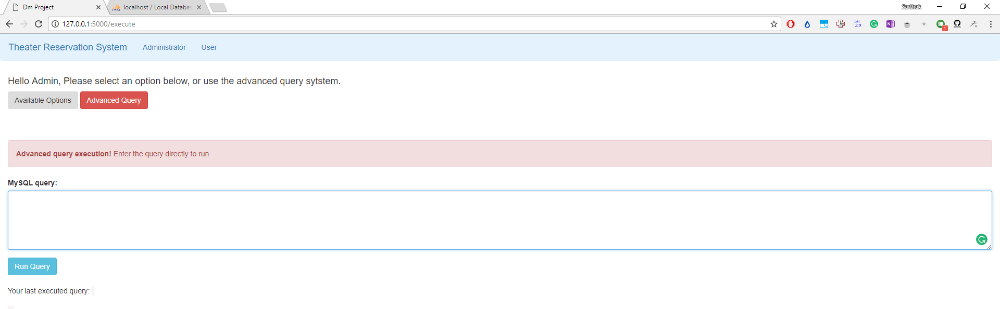
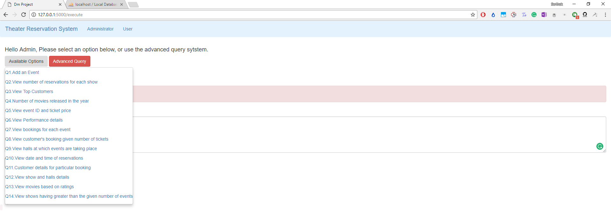
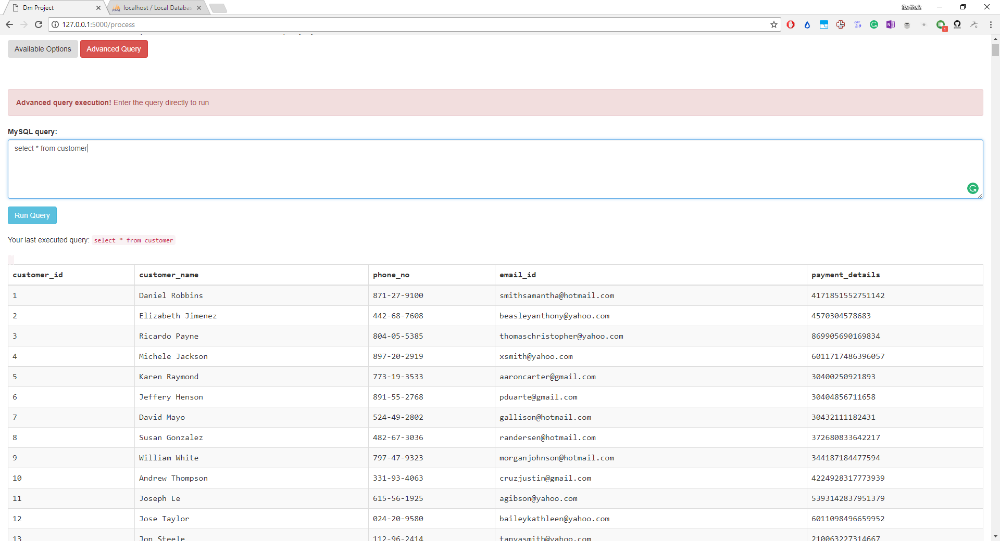
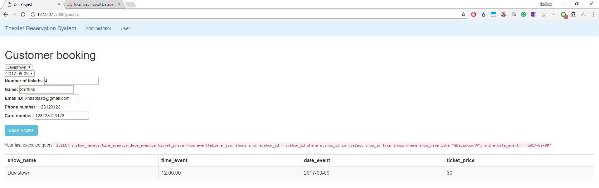
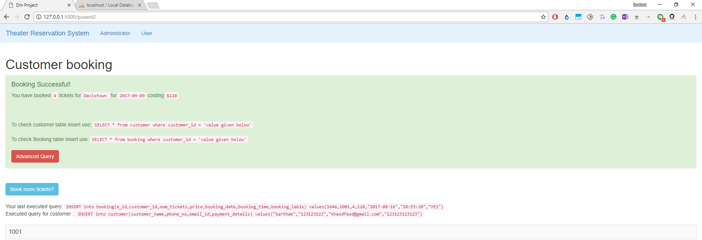

### Theater Reservation system

*A project to manage movie screenings, performances, bookings and customer data for a multiplex.*

* Built the web application from scratch using python flask and MySQL.
* The database had a relational model with queries handling tasks like insertions, updates, deletions. Triggers and indexes were also used.
* Generated the dummy data using python faker library.
* For more detailed explanation have a look at the [project report.](ProjectReport.pdf)
* You can also view the walkthrough of the project in this [video.](https://www.youtube.com/watch?v=ASg02X8B7UQ&feature=youtu.be)
Some images from the project.

* #### Landing page

* #### Admin View

* #### Available queries for admin

* #### Sample custom query for admin

* #### Booking a ticket as a customer

* #### Successful booking

